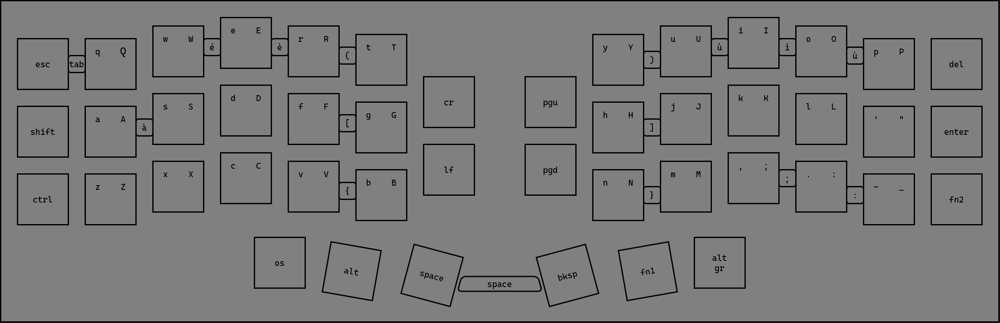
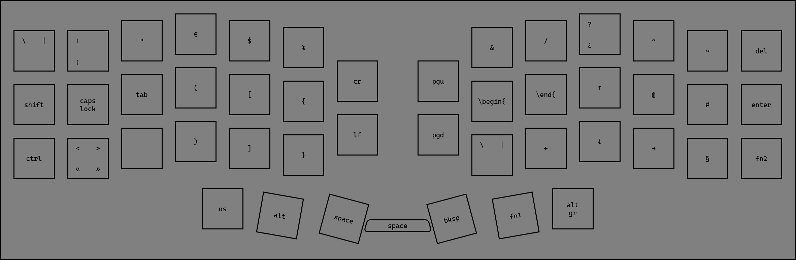
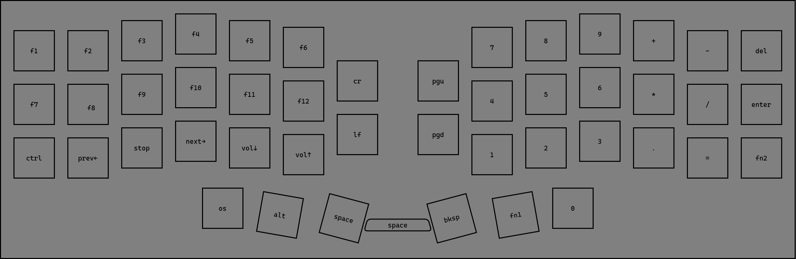

# crkbd

custom corne keyboard layout

## layout

i first created it in [draw.io](./layout.dio), and then i used vial to edit the [keymap](./keymap.vil)

**layer 0**

**layer 1** (fn1)

**layer 2** (fn2)

## license

under [wtfpl](./LICENSE)