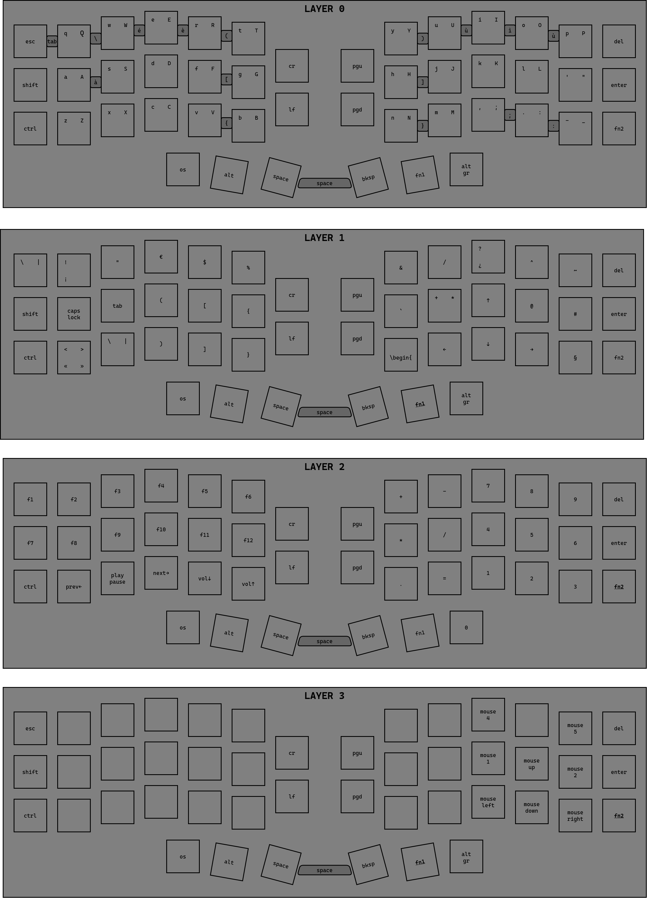

# crkbd

custom corne keyboard italian layout

## layout

i first created it in [draw.io](./layout.dio), and then i used vial to edit the [keymap](./keymap.vil)

> [!NOTE]
> the darker blocks are combos

## license

under [wtfpl](./LICENSE)
